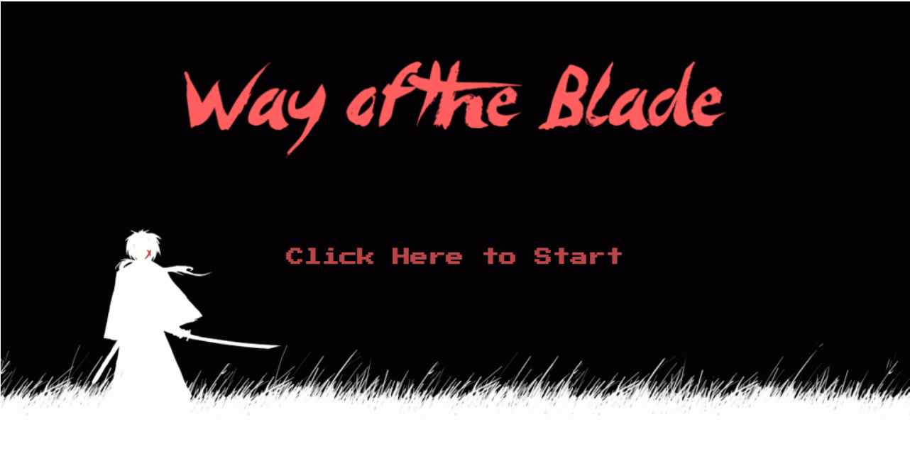
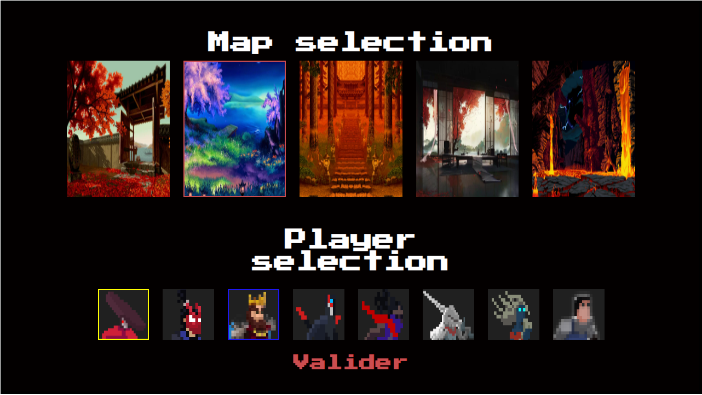
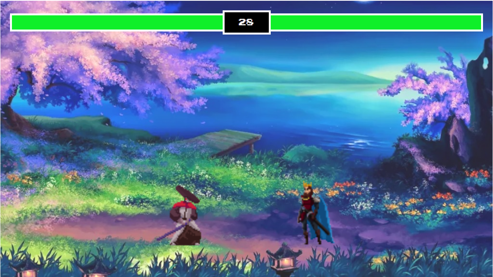
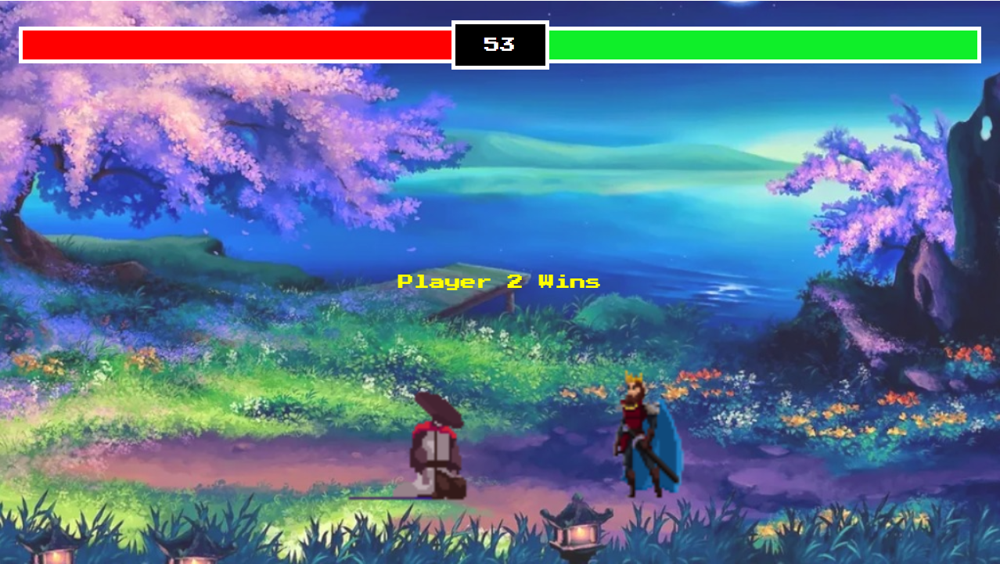

# WayOfTheBlade
--------
2-Player Sword fight game using Javascript and HTML canvas

Controls (Player1/Player2)
--------
- Z/UpArrow : Jump
- Q/LeftArrow : Move forward
- D/RightArrow : Move backward
- S/DownArrow : Attack

How it works
--------
- Click on the game's website here: [WayOfTheBlade](https://wayoftheblade.netlify.app/)
- Select the map by clicking on the top of the background image you want ( be sur to click on the top of the image, a red border will appear when done correctly)
- Select the player 1's character and the player 2's character by clicking on a character image ( a yellow border will appear for the player 1 , while a blue one will appear for the player 2)
- Hit "Valider"
- Have fun !

Edit* : refresh the page when you want to restart a game, there is no restart button unfortunately because of my laziness

Screenshots
--------

